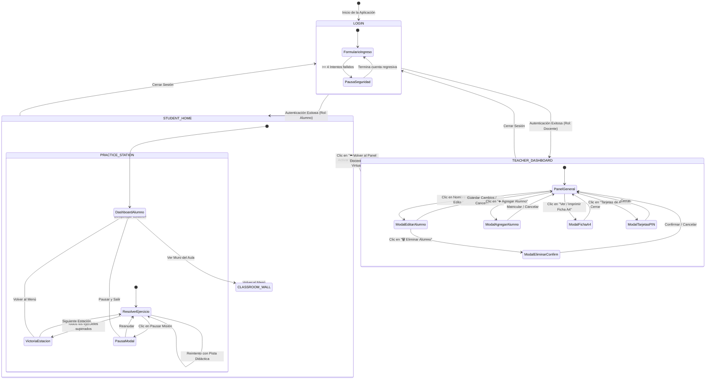

# 🗺️ APPFLOW: Mapa de Navegación y Máquina de Estados
## Expedición Matemática Perú • Colegio La Salle School (2026)

---

## 1. Diagrama de Estados Principal de la Aplicación

La aplicación se gobierna como una **Máquina de Estados Finita (FSM)** administrada por la propiedad `this.currentView`:

---

## 2. Flujo 1: Experiencia del Estudiante

### 2.1 Pantalla de Login y Pausa Progresiva
1. El estudiante ingresa `Usuario` (ej. `mateo.castillo`) y `Clave de Acceso (PIN)` (4 dígitos).
2. **Si las credenciales son válidas:**
   * Se inicializa la sesión en `localStorage`.
   * Se transiciona a la vista `STUDENT_HOME`.
3. **Si las credenciales son erróneas:**
   * Se emite un tono suave de error (`playFeedbackTone('error')`).
   * Se incrementa el contador de fallos.
   * **Intento 1 a 3:** Mensaje amigable advirtiendo cuántos intentos le quedan.
   * **Intento 4:** Pausa obligatoria de 30 segundos (campos deshabilitados con temporizador visual regresivo).
   * **Intento 5:** Pausa de 60 segundos.
   * **Intento 6+:** Pausa de 120 segundos indicando consultar su Tarjeta con el profesor.

### 2.2 Desafíos y Estaciones de Entrenamiento
1. En `STUDENT_HOME`, el estudiante observa:
   * Su avatar y saludo personalizado.
   * La misión curricular activa de la semana (ej. *Semana 1: Patrones Multiplicativos*).
   * La barra de progreso de sus 4 estaciones (Bronce, Plata, Oro, Diamante) con el estado de sus trofeos.
2. Al pulsar sobre una estación desbloqueada, ingresa a `PRACTICE_STATION`.
3. **Resolución de Micro-Ejercicios:**
   * El sistema presenta la consigna visual (ej. balanza de multiplicadores, recta de saltos).
   * El alumno elige una opción o introduce un número:
     * **Acierto:** Sonido alegre, +1 estrella, animación de confeti verde, avance automático al siguiente ejercicio tras 1.2 segundos.
     * **Error:** Sonido suave, botón resaltado en rojo, apertura inmediata de la **Caja de Pistas de Razonamiento (Andamiaje Finlandia)** explicando el concepto sin dar la respuesta final. El alumno puede corregir en el acto.
4. **Victoria de la Estación:**
   * Al culminar los micro-ejercicios (8 a 10 según la estación), se despliega el **Modal de Victoria** con el trofeo conquistado.
   * Opciones: «Siguiente Estación 🚀» o «Volver a Mis Desafíos 🏠».
5. **Pausa de la Misión:**
   * Si el estudiante pulsa el botón de pausa en la cabecera, se abre un diálogo que confirma que su progreso está 100% guardado y le permite volver al inicio.

---

## 3. Flujo 2: Experiencia y Monitoreo del Docente

### 3.1 Panel Central (Teacher Dashboard)
1. El docente inicia sesión con usuario `profesor` y su contraseña mensual/maestra.
2. La cabecera superior muestra:
   * Conexión a Supabase en vivo.
   * Selector del salón a monitorear: **`[ 4.° Sigma ]`** o **`[ 4.° Delta ]`**.
   * Botón directo **`🖨️ Tarjetas de Acceso`** (genera las credenciales del salón activo).
3. **Métricas Globales del Salón Activo:**
   * Alumnos inscritos.
   * Minutos totales de práctica acumulada.
   * Cantidad de niños que lograron el **Trofeo de Oro (Meta Oficial)**.
   * Estrellas acumuladas y promedio por alumno.
4. **Control Pedagógico de Ciclo:**
   * Selector del tema semanal activo (Semana 1 a 4).
   * Al cambiar de tema, se actualiza en bloque la misión para todos los dispositivos de los alumnos.

### 3.2 Tarjeta de Misión Semanal (Trío Interconectado)
Directamente vinculada al tema seleccionado, contiene tres acciones de un solo clic:
* **🎒 Alumno Virtual:** Inicia el simulador en el salón activo.
* **🖨️ Ver / Imprimir Ficha A4:** Abre el visor de la hoja fotocopiable con los 4 momentos pedagógicos.
* **📊 Exportar Excel:** Descarga el CSV con BOM UTF-8 con notas, minutos y emblemas de la semana elegida.

### 3.3 Gestión de la Nómina Escolar (CRUD de Alumnos)
* **Editar Alumno:**
  * Al hacer clic en el nombre subrayado o en el botón **`✏️ Editar`**, se abre el modal.
  * Permite modificar Apellidos, Nombres, Usuario y Clave PIN.
  * Valida en tiempo real que el PIN de 4 dígitos sea único en toda la escuela (advierte en rojo si ya lo tiene otro alumno y bloquea el botón guardar).
  * Incluye botón **`🎲 Generar PIN`** para sugerir una clave libre.
* **Matricular Nuevo Alumno:**
  * Clic en **`➕ Agregar Alumno a 4.° [Sigma/Delta]`**.
  * Previsualiza en vivo el usuario asignado (`nombre.apellido`).
  * Asigna un PIN único garantizado.
  * Al confirmar: inserta al alumno, reordena alfabéticamente a toda la sección y reasigna los números de lista (`N° 01, 02, 03...`).
* **Eliminar Alumno (Lógica Pedagógica y de Seguridad):**
  * Desde el modal de edición, clic en **`🗑️ Eliminar Alumno`**.
  * Diálogo de confirmación que detalla:
    * Se descuentan sus puntos y minutos de las estadísticas del aula.
    * Los promedios se recalculan sobre los alumnos activos.
    * El número de orden correlativo se ajusta automáticamente.
    * Acción permanente e irreversible.

### 3.4 Modo Simulador Docente (Alumno Virtual)
* Al ingresar, el profesor visualiza la plataforma exactamente como un estudiante de ese salón.
* Se añade una barra superior fija de color azul oscuro con resplandor neón:
  * Indica el salón simulado y el tema evaluado.
  * Botón **`🔄 Reiniciar simulador`**: resetea estrellas, trofeos y progreso del alumno virtual a cero para permitir pruebas repetidas.
  * Botón **`⬅️ Volver al Panel Docente`**: regresa al dashboard administrativo sin dejar residuos en las métricas reales.
