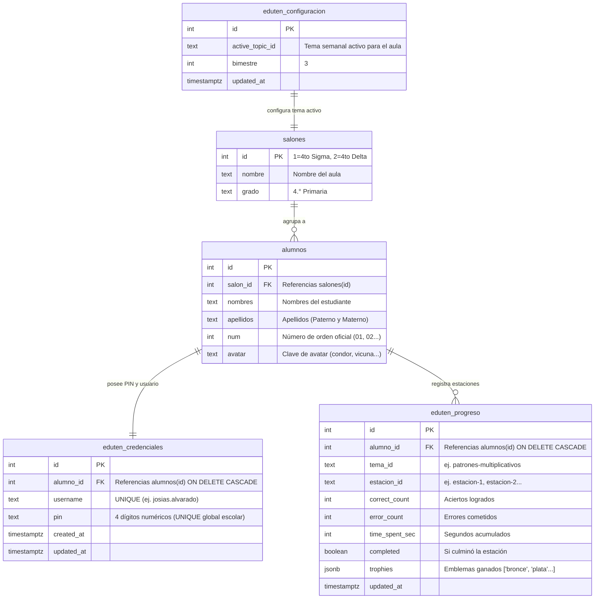
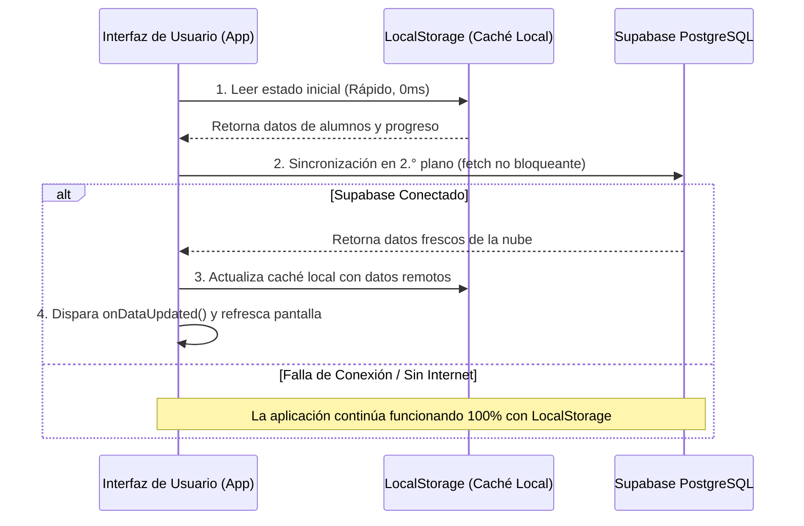

# 🗄️ BACKEND_SCHEMA: Modelo de Datos, Base de Datos y Políticas de Seguridad
## Supabase PostgreSQL • Expedición Matemática (2026)

---

## 1. Arquitectura de Datos Satélite

La base de datos en Supabase (`bpffczohkcpoxyhzvdru`) opera bajo un modelo de **tablas satélite dedicadas**:
* **Aislamiento Total:** No interfiere ni modifica el esquema de evaluaciones ni notas oficiales del colegio.
* **Integridad Referencial:** Los datos de práctica, credenciales PIN y progreso escolar se vinculan con llaves foráneas (`FOREIGN KEY`) hacia la tabla maestra de `alumnos` y `salones`.

---

## 2. Diagrama Entidad-Relación (ERD)

---

## 3. Diccionario de Datos de Tablas

### 3.1 Tabla: `salones`
Contiene la división administrativa de aulas.
* `id` (INTEGER, PK): Identificador numérico (`1`: 4.° Sigma, `2`: 4.° Delta).
* `nombre` (TEXT): Nombre descriptivo (`4to P Sigma`, `4to P Delta`).
* `grado` (TEXT): Grado escolar (`4to Primaria`).

### 3.2 Tabla: `alumnos`
Registro escolar oficial de cada estudiante.
* `id` (INTEGER, PK): ID único autoincremental.
* `salon_id` (INTEGER, FK): Salón al que pertenece (`1` o `2`).
* `nombres` (TEXT): Nombres del estudiante.
* `apellidos` (TEXT): Apellidos paterno y materno.
* `num` (INTEGER): Número de lista oficial reordenado alfabéticamente.
* `avatar` (TEXT): Clave del avatar representativo.

### 3.3 Tabla: `eduten_credenciales`
Almacena las credenciales de acceso de los estudiantes.
* `id` (INTEGER, PK): ID autoincremental.
* `alumno_id` (INTEGER, FK): Vinculado a `alumnos.id` (`ON DELETE CASCADE`).
* `username` (TEXT, UNIQUE): Nombre de usuario sanitizado (`nombre.apellido`).
* `pin` (TEXT, UNIQUE): Clave numérica de **4 dígitos exactos**. Protegido contra duplicados escolares mediante restricción de unicidad.
* `updated_at` (TIMESTAMPTZ): Marca de tiempo del último cambio de PIN.

### 3.4 Tabla: `eduten_progreso`
Historial de micro-ejercicios y estaciones resueltas.
* `id` (INTEGER, PK): ID autoincremental.
* `alumno_id` (INTEGER, FK): Vinculado a `alumnos.id` (`ON DELETE CASCADE`).
* `tema_id` (TEXT): Clave curricular (`patrones-multiplicativos`, `division-reparto`, etc.).
* `estacion_id` (TEXT): Estación correspondiente (`estacion-1`, `estacion-2`, `estacion-3`, `estacion-diamante`).
* `correct_count` (INTEGER): Número de aciertos en la estación.
* `error_count` (INTEGER): Número de fallas formativas cometidas.
* `time_spent_sec` (INTEGER): Tiempo activo en segundos dedicado a la estación.
* `completed` (BOOLEAN): Estado de finalización de la estación.
* `trophies` (JSONB): Matriz de trofeos alcanzados (`["bronce", "plata", "oro"]`).
* `updated_at` (TIMESTAMPTZ): Fecha y hora de la última interacción.

### 3.5 Tabla: `eduten_configuracion`
Configuración global del ciclo escolar gestionada por el docente.
* `id` (INTEGER, PK): Registro único `1`.
* `active_topic_id` (TEXT): Identificador del tema semanal que ven los alumnos al entrar.
* `bimestre` (INTEGER): Bimestre en curso (`3`).
* `updated_at` (TIMESTAMPTZ): Momento en que el docente cambió de tema.

---

## 4. Políticas de Seguridad RLS (Row Level Security)

Para proteger la integridad de los datos ante accesos indebidos desde el navegador del cliente:

| Tabla | Operación | Rol Permitido | Regla / Restricción de Seguridad |
| :--- | :--- | :--- | :--- |
| `salones` | `SELECT` | `anon` (Público) | Permitido solo lectura. |
| `salones` | `INSERT / UPDATE / DELETE` | Ninguno (`anon`) | **Bloqueado**. Administrado solo por backend. |
| `alumnos` | `SELECT` | `anon` (Público) | Lectura para poblar las nóminas de clase. |
| `alumnos` | `DELETE` | `anon` (Público) | **Bloqueado por RLS**. Protege contra borrados no autorizados. |
| `eduten_credenciales` | `SELECT` | `anon` (Público) | Permitido para cotejo de login con PIN. |
| `eduten_credenciales` | `UPDATE (pin)` | `anon` (Público) | Permitido **únicamente sobre la columna `pin`** al editar datos docentes. |
| `eduten_progreso` | `SELECT` | `anon` (Público) | Permitido para consultar estrellas y trofeos propios y del aula. |
| `eduten_progreso` | `INSERT / UPDATE` | `anon` (Público) | Permitido **UPSERT** con `alumno_id` válido. |
| `eduten_progreso` | `DELETE` | `anon` (Público) | **Bloqueado al 100%**. Nadie puede borrar progreso histórico. |
| `eduten_configuracion` | `SELECT` | `anon` (Público) | Permitido para saber qué tema cargar al alumno. |
| `eduten_configuracion` | `UPDATE` | `anon` (Público) | Permitido para activar el tema desde el Dashboard Docente. |

---

## 5. Estrategia Híbrida Offline-First y Sincronización

### 5.1 Resolución de Conflictos
1. **Prioridad Temporal (*Last Write Wins*):** Las marcas de tiempo `updated_at` deciden la versión más reciente en caso de concurrencia.
2. **Respaldo Inmune:** Si la red escolar cae durante una clase completa, el alumno sigue practicando, acumulando estrellas y ganando trofeos en su `localStorage`. Al restablecerse la red en el siguiente inicio de sesión, el cliente sincroniza los registros pendientes con Supabase.
