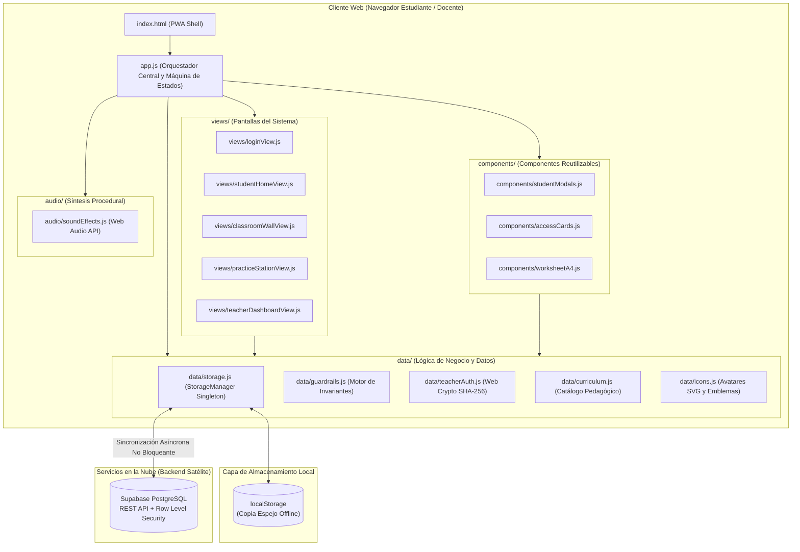

# 🛠️ TDR: Revisión de Diseño Técnico (Technical Design Review)
## Arquitectura de Software y Stack Tecnológico • Expedición Matemática (2026)

---

## 1. Resumen Ejecutivo y Filosofía de Arquitectura

El diseño técnico de **Expedición Matemática Perú** se rige por el principio de **Zero Bloat / Máximo Rendimiento**:
* **Sin dependencias pesadas:** No se utilizan frameworks de empaquetado ni dependencias de runtime masivas (React, Angular, Webpack). Esto garantiza tiempos de descarga inferiores a 0.8s en conexiones peruanas escolares.
* **Estándar Nativo Moderno:** Uso exclusivo de **JavaScript ES6+ con Módulos nativos (`type="module"`)**, **HTML5 semántico**, y **CSS3 con Variables y Contenedores Flex/Grid**.
* **Arquitectura Híbrida Offline-First:** Persistencia primaria en caché local (`localStorage`) combinada con sincronización REST asíncrona hacia Supabase PostgreSQL.

---

## 2. Diagrama de Arquitectura de la Aplicación



---

## 3. Stack Tecnológico Detallado

| Capa | Tecnología | Justificación Técnica |
| :--- | :--- | :--- |
| **Lenguaje Core** | JavaScript ES2022+ Nativo | Rendimiento nativo en V8 / WebKit sin paso de transpilación lento. |
| **Módulos** | ES Modules (`import` / `export`) | Carga desacoplada de dependencias con resolución limpia en el navegador. |
| **Estilos** | CSS3 Vanilla con Custom Properties | Modo dual (Andino institucional y Cyber-Tech) mediante variables CSS reactivas. |
| **Persistencia Local**| Web Storage API (`localStorage`) | Práctica continua en aula sin interrupciones por caídas de conectividad escolar. |
| **Backend / BD** | Supabase (PostgreSQL 15) | Base de datos relacional con API REST automática, SSL y autenticación por API Key. |
| **Seguridad Cliente**| Web Cryptography API (`crypto.subtle`) | Hashing criptográfico SHA-256 local para claves docentes; cero texto plano en el cliente. |
| **Motor de Impresión**| Iframe Aislado Dinámico | Impresión A4 pixel-perfect sin romper el diseño responsive de la pantalla. |
| **Calidad / CI** | Node.js + Headless Chrome | Suite automatizada de verificación de sintaxis y renderizado real antes del despliegue. |

---

## 4. Gestión de Estado y Ciclo de Vida (State Management)

### 4.1 Patrón Singleton: `StorageManager`
* Centralizado en `data/storage.js`. Es el único punto de lectura y mutación del estado.
* Inicializa leyendo el caché local. Si no existe, puebla con la semilla oficial de 59 alumnos (`INITIAL_STUDENTS`).
* **Sincronización Asíncrona con Supabase:**
  * Al iniciar sesión o registrar un desafío, emite llamadas REST asíncronas no bloqueantes.
  * Si la conexión a internet falla o tiene alta latencia, la aplicación no se congela: opera con el caché local y sincroniza en el próximo ciclo.
* **Patrón de Reactividad:** Dispone del callback `onDataUpdated()`, que notifica a la interfaz gráfica (`App.render()`) cuando los datos remotos de Supabase se han actualizado en segundo plano.

### 4.2 Motor de Renderizado Funcional
* La clase principal `ExpedicionApp` implementa un ciclo de renderizado determinista:
  1. `render()` evalúa la vista activa (`this.currentView`).
  2. Genera plantillas literales (*template strings*) sanitizadas con `escapeHtml()`.
  3. Inserta el HTML en el contenedor raíz `<div id="app"></div>`.
  4. Enlaza los listeners correspondientes (`attachLoginEvents()`, `attachTeacherEvents()`, etc.).

---

## 5. Decisiones Clave de Diseño y Compromisos (Trade-offs)

### 5.1 ¿Por qué no usar React o Vue?
* **Decisión:** Mantener Vanilla JS puro.
* **Trade-off:** Requiere gestionar manualmente los event listeners tras cada re-renderizado.
* **Beneficio:** 0 KB de librerías externas descargadas. El bundle total pesa menos de 250 KB con avatares incluidos, cargando de inmediato en computadoras escolares de bajos recursos.

### 5.2 Prevención de Colisiones de Nombres (`window.app` vs. `<div id="app">`)
* **Problema Histórico:** En navegadores HTML5, cualquier elemento con `id="nombre"` crea automáticamente una variable global `window.nombre`.
* **Solución Técnica:** Se prohíbe el uso de `window.app`. La instancia global se almacena bajo el espacio protegido `window.expedicionAppInstance`, impidiendo que el motor asuma que la aplicación ya estaba instanciada.

### 5.3 Asignación Estricta de Event Listeners
* **Problema:** Patrones como `elemento?.onclick = ...` arrojan `SyntaxError: Invalid left-hand side in assignment` en motores Chromium/WebKit.
* **Solución Técnica:** Se adoptó la asignación explícita mediante comprobación condicional:
  ```javascript
  const btn = document.getElementById('id-boton');
  if (btn) btn.onclick = () => { ... };
  ```
  O mediante `elemento?.addEventListener('click', ...)`.

### 5.4 Motor de Impresión A4 de Alta Fidelidad
* Para evitar que la barra lateral, cabeceras o botones del navegador salgan en las fichas o tarjetas de credenciales, el sistema crea un `<iframe>` invisible en tiempo de ejecución, inyecta el HTML específico con `@page { size: A4 portrait; margin: 8mm; }` y dispara `iframe.contentWindow.print()`.

---

## 6. Monitoreo, Pruebas y Aseguramiento de Calidad (QA)

Antes de cualquier despliegue a producción en GitHub Pages, se ejecuta el verificador formal:
```bash
node scripts/verify_guardrails.js
```
El script valida:
1. **Escaneo estático AST/Regex:** Ausencia de asignaciones a encadenamientos opcionales (`?. =`) y ausencia de colisiones globales.
2. **Escaneo de Shell HTML:** Ausencia de interceptores que secuestren el DOM principal.
3. **Ejecución en Chrome Headless:** Comprueba que en un navegador real el formulario de login cargue sin excepciones y con cero banners de error.
